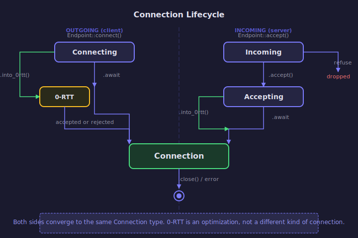

# Connection Lifecycle

Connections are how iroh endpoints communicate. A `Connection` wraps a QUIC connection
(via `noq::Connection`) and adds iroh-specific functionality: endpoint identity verification,
path management, and integration with the socket layer.

## Overview

There are multiple transitional types between initiating a connection and having a fully
established one. The path diverges based on direction (outgoing vs incoming) and whether
0-RTT is used, but both sides converge to the same `Connection` type.

<!-- BEGIN GENERATED SECTION
Source: iroh/src/endpoint/connection.rs
Prompt: Read all the public types in this module. Generate an SVG state diagram showing
        the lifecycle of both outgoing and incoming connections, including 0-RTT paths.
        Follow the style guide in _prompts/regenerate.md.
-->

<!-- END GENERATED SECTION -->

## Registration with the Socket

After the QUIC handshake completes, every connection goes through `conn_from_noq_conn()`:

1. Extracts the remote `EndpointId` from the TLS certificate
2. Extracts the ALPN protocol from the handshake data
3. Registers with the `RemoteStateActor` for this peer (hooks up path management)
4. Runs the `after_handshake` hook, which may reject the connection

This is what connects the QUIC connection to iroh's path management layer.

## 0-RTT Security Model

0-RTT data is vulnerable to replay attacks:
- **Outgoing** (`Connecting::into_0rtt`): The remote may reject it entirely. Only use for idempotent operations.
- **Incoming** (`Accepting::into_0rtt`): Allows receiving 0-RTT data or sending 0.5-RTT data before the handshake completes. 0.5-RTT is sent before TLS client authentication.
