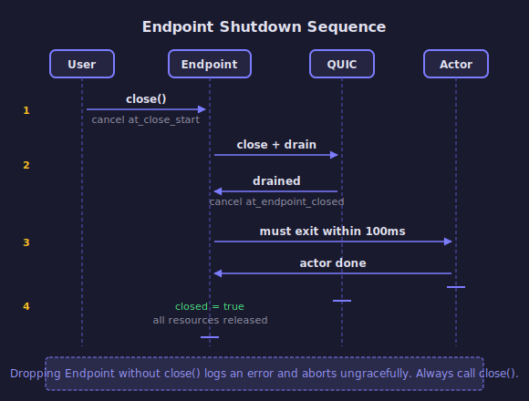

# Endpoint Shutdown

Shutting down an iroh `Endpoint` is a coordinated 4-phase process.

<!-- BEGIN GENERATED SECTION
Source: iroh/src/socket.rs
Prompt: Read the ShutdownState struct and EndpointInner close/drop logic.
        Generate an SVG sequence diagram following the style guide in _prompts/regenerate.md.
-->

<!-- END GENERATED SECTION -->

## The Phases

| Phase | What happens | Coordinated by |
|-------|-------------|----------------|
| 1 | `Endpoint::close()` called | `at_close_start` token cancelled |
| 2 | `noq::Endpoint` drains existing QUIC connections | `at_endpoint_closed` token cancelled |
| 3 | Socket actor must exit within 100ms (shuts down transports, relays) | Task join |
| 4 | All resources released | `closed` flag set to `true` |

The two query methods reflect where you are:
- `is_closing()` — true from phase 1 onward
- `is_closed()` — true only at phase 4

## Drop Safety

If `Endpoint` is dropped without calling `close()`, the `Drop` impl on `EndpointInner`
logs an error and calls `abort()`. Always call `close()` for clean shutdown.
