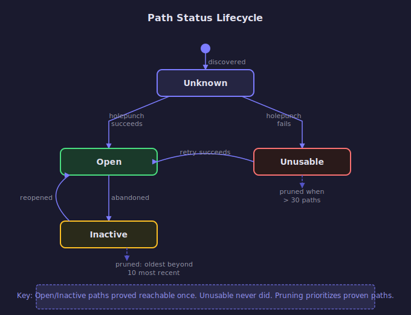

# Path Lifecycle

A "path" in iroh is a network route to a remote endpoint — a direct UDP address, a relay
server, or a custom transport. Each remote endpoint can have many candidate paths. Iroh
discovers them, tests them via holepunching, selects the best one, and prunes the rest.

## Path Types

Paths are identified by `transports::Addr`:
- **`Ip(SocketAddr)`** — Direct UDP
- **`Relay(RelayUrl, EndpointId)`** — Via relay server
- **`Custom(CustomAddr)`** — Custom transport

## Path Status State Machine

<!-- BEGIN GENERATED SECTION
Source: iroh/src/socket/remote_map/remote_state/path_state.rs
Prompt: Read the PathStatus enum and the methods insert_open_path(), abandoned_path(),
        insert_multiple(), and prune_non_relay_paths(). Generate an SVG state diagram
        following the style guide in _prompts/regenerate.md.
-->

<!-- END GENERATED SECTION -->

The key distinction is between paths that have **proven reachable** (Open, Inactive) and
those that haven't (Unknown, Unusable). This matters for pruning: when the path map grows
beyond 30 entries, iroh keeps proven paths and discards unproven ones.

## Path Sources

Each path tracks how it was discovered via `Source`:
- **UDP** — Discovered via direct communication
- **Relay** — Learned through relay
- **AddressLookup** — Found via DNS, mDNS, Pkarr, or other discovery

Only the latest timestamp per source type is stored — this keeps the source map bounded.
