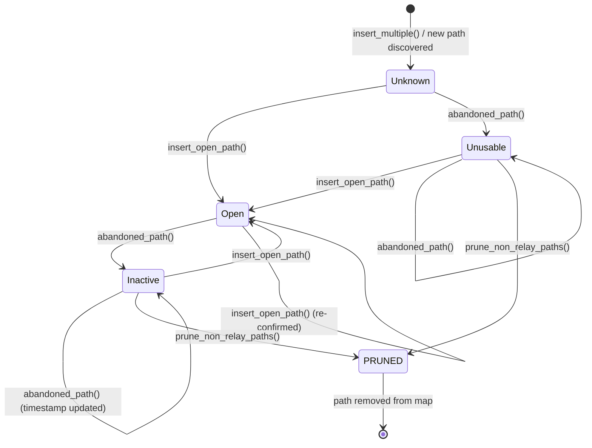
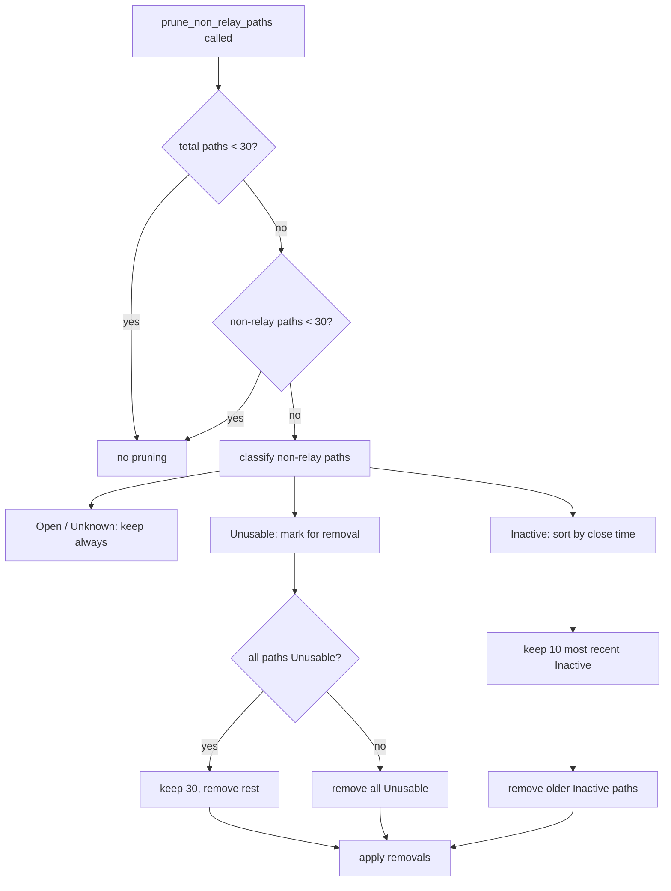

# Path Lifecycle

A "path" in iroh is a network route to a remote endpoint. Each remote endpoint can have
many paths: direct IP, via relay, or via custom transports. Paths are discovered, tested
via holepunching, used, and eventually pruned.

## Path Types

Paths are identified by `transports::Addr`, which has three variants:
- **`Ip(SocketAddr)`** — Direct UDP path
- **`Relay(RelayUrl, EndpointId)`** — Path through a relay server
- **`Custom(CustomAddr)`** — Custom transport path

## Path Status State Machine

Each path has a `PathStatus` that tracks its usability.

<!-- BEGIN GENERATED SECTION
Source: iroh/src/socket/remote_map/remote_state/path_state.rs
Prompt: Read the PathStatus enum and the methods insert_open_path(), abandoned_path(),
        and insert_multiple(). Generate a stateDiagram-v2 showing all status transitions
        with the method that triggers each. Also read the prune_non_relay_paths() function
        and document which states get pruned.
-->

### States

| Status | Meaning | Default |
|--------|---------|---------|
| `Unknown` | Not yet attempted or holepunch in progress | Yes (default) |
| `Open` | Path is active and working | |
| `Inactive(Instant)` | Was once open, closed at the given time | |
| `Unusable` | Holepunch was attempted and failed | |

### Transition Details

| From | To | Trigger | Code |
|------|----|---------|------|
| (new) | `Unknown` | `insert_multiple()` — address lookup discovers new addresses | `path_state.rs` |
| `Unknown` | `Open` | `insert_open_path()` — holepunch succeeds or direct connection works | `path_state.rs` |
| `Unknown` | `Unusable` | `abandoned_path()` — holepunch attempted, didn't work | `path_state.rs` |
| `Open` | `Inactive` | `abandoned_path()` — path was open but is now closed | `path_state.rs` |
| `Inactive` | `Inactive` | `abandoned_path()` — timestamp refreshed, stays inactive | `path_state.rs` |
| `Inactive` | `Open` | `insert_open_path()` — path re-established | `path_state.rs` |
| `Unusable` | `Open` | `insert_open_path()` — retry succeeded | `path_state.rs` |
| `Unusable` | `Unusable` | `abandoned_path()` — still unusable | `path_state.rs` |

<!-- END GENERATED SECTION -->

## Path Pruning

Pruning prevents unbounded growth of the path map. It only applies to non-relay paths
and only triggers when the total count exceeds `MAX_NON_RELAY_PATHS` (30).

<!-- BEGIN GENERATED SECTION
Source: iroh/src/socket/remote_map/remote_state/path_state.rs
Prompt: Read the prune_non_relay_paths() function and the constants MAX_NON_RELAY_PATHS
        and MAX_INACTIVE_NON_RELAY_PATHS. Generate a flowchart showing the pruning decision
        logic.
-->

### Constants

| Constant | Value | Purpose |
|----------|-------|---------|
| `MAX_NON_RELAY_PATHS` | 30 | Max non-relay paths before pruning triggers |
| `MAX_INACTIVE_NON_RELAY_PATHS` | 10 | How many inactive (previously-working) paths to keep |

<!-- END GENERATED SECTION -->

## Path Sources

Each path tracks how it was discovered via `Source`:
- **UDP** — Discovered via direct UDP communication
- **Relay** — Learned through relay communication
- **AddressLookup** — Found via DNS, mDNS, Pkarr, or other discovery mechanisms

The source and timestamp are stored in `PathState::sources`, keeping only the latest
timestamp per source type.
