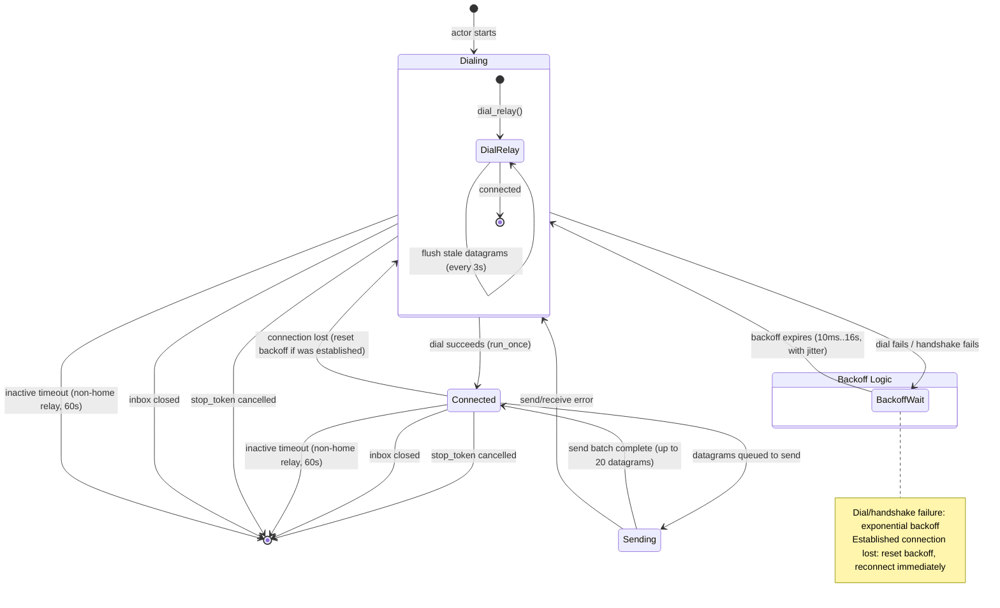
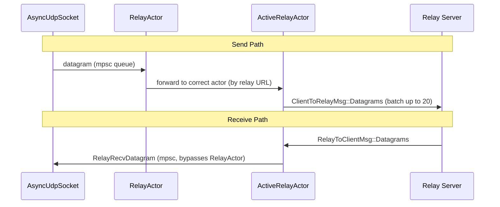

# Relay Actor

The relay layer manages connections to relay servers, which provide fallback connectivity
when direct peer-to-peer connections are not possible. The architecture is a two-level
actor system.

## Architecture

```
RelayActor (one per endpoint)
├── ActiveRelayActor (home relay, persistent)
├── ActiveRelayActor (relay A, ephemeral)
└── ActiveRelayActor (relay B, ephemeral)
```

- **`RelayActor`** manages all relay connections. It routes datagrams to the correct
  `ActiveRelayActor` based on the relay URL.
- **`ActiveRelayActor`** manages a single relay server connection. It handles dialing,
  reconnection with backoff, sending, and receiving.

## ActiveRelayActor State Machine

Each `ActiveRelayActor` has three main states, driven from the `run()` loop.

<!-- BEGIN GENERATED SECTION
Source: iroh/src/socket/transports/relay/actor.rs
Prompt: Read the ActiveRelayActor struct, its run(), run_once(), run_dialing(), and
        run_connected() methods. Generate a stateDiagram-v2 showing the three main states
        (Dialing, Connected, Sending) and the transitions between them, including error
        paths and the backoff/retry logic. Include the shutdown conditions.
-->



### States

| State | Method | Description |
|-------|--------|-------------|
| Dialing | `run_dialing()` | Connecting to relay server. Stale datagrams flushed every 3s. |
| Connected | `run_connected()` | Connected and receiving. Idle for sending. |
| Sending | `run_sending()` | Sub-state of Connected. Actively sending a batch of datagrams. |
| BackoffWait | (in `run()` loop) | Waiting before retry after dial/handshake failure. |

### Key Behaviors

| Behavior | Detail |
|----------|--------|
| Home relay | Never exits due to inactivity. Connection maintained indefinitely. |
| Non-home relay | Exits after 60s idle (`RELAY_INACTIVE_CLEANUP_TIME`). |
| Ping interval | Every 15s (`PING_INTERVAL`) to keep QUIC alive (30s idle timeout). |
| Send batch size | Up to 20 datagrams per batch (`SEND_DATAGRAM_BATCH_SIZE`). |
| Connect timeout | 10s (`CONNECT_TIMEOUT`) including DNS, TCP, TLS, WebSocket upgrade, handshake. |
| Stale datagram flush | Every 3s (`UNDELIVERABLE_DATAGRAM_TIMEOUT`) while disconnected. |
| Backoff | Exponential: 10ms min, 16s max, with jitter, unlimited retries. |
| Network change | `CheckConnection` message: if local IP changed, force reconnect; otherwise ping. |

<!-- END GENERATED SECTION -->

## Datagram Flow

<!-- BEGIN GENERATED SECTION
Source: iroh/src/socket/transports/relay/actor.rs
Prompt: Read the module-level doc comment describing send and receive paths.
        Generate a sequenceDiagram showing how datagrams flow from the Socket through
        the RelayActor to the ActiveRelayActor and relay server, and back.
-->



<!-- END GENERATED SECTION -->

## Relay Server Messages

The relay protocol uses distinct message types for each direction:

**Client to Relay**: `Ping`, `Pong`, `Datagrams { dst_endpoint_id, datagrams }`

**Relay to Client**: `Datagrams { remote_endpoint_id, datagrams }`, `EndpointGone`, `Health`, `Restarting`, `Ping`, `Pong`
