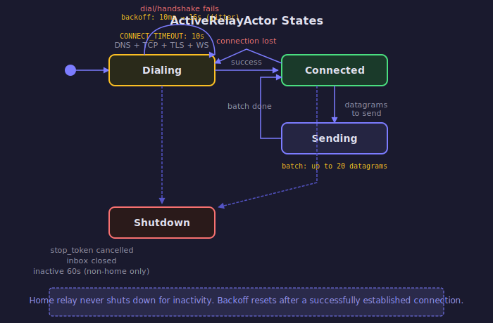

# Relay Actor

The relay layer provides fallback connectivity when direct peer-to-peer connections are not
possible. It's a two-level actor system: `RelayActor` manages all relay connections,
spawning an `ActiveRelayActor` per relay server.

## ActiveRelayActor State Machine

Each `ActiveRelayActor` cycles through three states. The key behavior is the backoff
strategy: dial/handshake failures trigger exponential backoff, but if a connection was
established and *then* lost, backoff resets and reconnection is immediate.

<!-- BEGIN GENERATED SECTION
Source: iroh/src/socket/transports/relay/actor.rs
Prompt: Read the ActiveRelayActor struct, run(), run_once(), run_dialing(), run_connected().
        Generate an SVG state diagram following the style guide in _prompts/regenerate.md.
        Focus on the three main states and the backoff/retry logic.
-->

<!-- END GENERATED SECTION -->

## Datagram Flow

The send and receive paths are asymmetric:

**Send**: Application -> `noq::Endpoint` -> `RelayActor` -> `ActiveRelayActor` -> relay server (batched, up to 20 per batch)

**Receive**: Relay server -> `ActiveRelayActor` -> `noq::Endpoint` (bypasses `RelayActor` — straight to QUIC via mpsc channel)

This asymmetry means receive latency is minimized — datagrams don't queue through the
relay actor on the way in.
