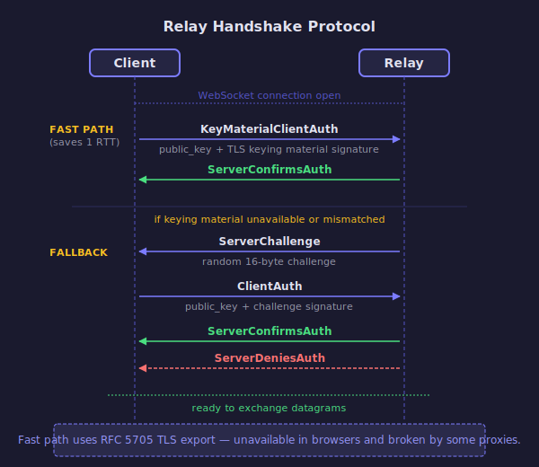

# Relay Handshake Protocol

The relay handshake authenticates clients connecting to relay servers. Its purpose:
1. Inform the relay of the client's `EndpointId`
2. Verify the client owns the secret key for that ID
3. Optionally check authorization

## Protocol Flow

There are two authentication paths. The fast path saves a round trip but doesn't work
everywhere. The fallback always works.

<!-- BEGIN GENERATED SECTION
Source: iroh-relay/src/protos/handshake.rs
Prompt: Read the frame types and handshake flow. Generate an SVG sequence diagram
        following the style guide in _prompts/regenerate.md.
-->

<!-- END GENERATED SECTION -->

## Why Two Paths?

The **fast path** signs material derived from the TLS session via
[RFC 5705](https://datatracker.ietf.org/doc/html/rfc5705), similar to
[Concealed HTTP Auth (RFC 9729)](https://datatracker.ietf.org/doc/rfc9729/).
No challenge needed — saves a full round trip.

It fails when:
- **Browsers** don't expose the TLS keying material export API
- **HTTPS proxies** break the TLS session, making the extracted material mismatch

The **fallback** (challenge-response) always works but costs an extra round trip.
