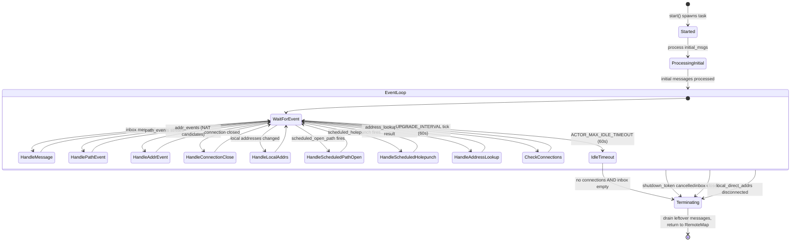

# Remote State Actor

For each remote endpoint that an iroh node communicates with, a `RemoteStateActor` manages
all connections, paths, holepunching, and path selection. It is the central orchestrator
for per-peer connectivity.

## Responsibilities

1. **Connection tracking** — registers/unregisters QUIC connections, monitors path events
2. **Path management** — maintains the set of known paths (`RemotePathState`)
3. **Holepunching** — triggers and schedules hole punch attempts
4. **Path selection** — selects the best path based on latency and transport preference
5. **Address lookup** — runs discovery to find new paths

## Actor Lifecycle

<!-- BEGIN GENERATED SECTION
Source: iroh/src/socket/remote_map/remote_state.rs
Prompt: Read the RemoteStateActor::run() method and the start() method.
        Generate a stateDiagram-v2 showing the actor lifecycle including
        startup, the main event loop, idle timeout, and shutdown conditions.
-->

### Shutdown Conditions

| Condition | Trigger |
|-----------|---------|
| Explicit shutdown | `shutdown_token` cancelled (endpoint closing) |
| Inbox closed | All senders dropped |
| Idle timeout | 60s with no connections and empty inbox |
| Address watcher gone | `local_direct_addrs` watcher disconnected |

<!-- END GENERATED SECTION -->

## Message Types

The actor processes `RemoteStateMessage` variants:

<!-- BEGIN GENERATED SECTION
Source: iroh/src/socket/remote_map/remote_state.rs
Prompt: Read the RemoteStateMessage enum (search for it in the file or in remote_map.rs)
        and the handle_message() method. List all message variants with their purpose.
-->

| Message | Purpose |
|---------|---------|
| `SendDatagram(sender, transmit)` | Send a datagram to this remote; uses selected path or broadcasts to all known paths |
| `AddConnection(handle, tx)` | Register a new QUIC connection; hooks up path/addr event streams |
| `ResolveRemote(addrs, tx)` | Wait until at least one path is known; triggers address lookup |
| `RemoteInfo(tx)` | Return current `RemoteInfo` (endpoint ID + known addresses) |
| `NetworkChange { is_major }` | Network change detected; triggers holepunching and notifies connections |

<!-- END GENERATED SECTION -->

## Holepunching Logic

<!-- BEGIN GENERATED SECTION
Source: iroh/src/socket/remote_map/remote_state.rs
Prompt: Read trigger_holepunching() and related methods. Describe the holepunching
        decision logic: when it triggers, what it does, and the throttling.
-->

Holepunching is the process of opening direct paths to a remote peer by exchanging
NAT traversal candidates through QUIC's built-in mechanisms.

**When holepunching triggers:**
- A new connection is added
- Local addresses change
- NAT traversal candidates are updated
- A scheduled holepunch timer fires

**Throttling:**
- Attempts are spaced at least `HOLEPUNCH_ATTEMPTS_INTERVAL` (5s) apart
- If NAT candidates haven't changed since the last attempt, the attempt is skipped
- The attempt is scheduled (not immediate) to coalesce multiple triggers

<!-- END GENERATED SECTION -->

## Path Selection

<!-- BEGIN GENERATED SECTION
Source: iroh/src/socket/remote_map/remote_state.rs
Prompt: Read the path selection logic (select_best_path or equivalent).
        Describe the selection criteria and upgrade behavior.
-->

The actor maintains a `selected_path: Watchable<Option<transports::Addr>>` that represents
the currently preferred path.

**Selection criteria:**
- Direct IP paths are preferred over relay paths (configurable via `TransportBiasMap`)
- Among IP paths, the one with lowest RTT wins, with a minimum switching threshold of 5ms (`RTT_SWITCHING_MIN_IP`)
- A path with latency <= 10ms (`GOOD_ENOUGH_LATENCY`) is considered good enough; no further upgrades attempted
- Path selection is re-evaluated on every path event from noq

**Upgrade behavior:**
- Every 60s (`UPGRADE_INTERVAL`), `check_connections()` evaluates whether a better path exists
- Even if a working non-relay path exists, holepunching continues to find potentially better paths

<!-- END GENERATED SECTION -->

## Constants

| Constant | Value | Purpose |
|----------|-------|---------|
| `HOLEPUNCH_ATTEMPTS_INTERVAL` | 5s | Min interval between holepunch attempts |
| `GOOD_ENOUGH_LATENCY` | 10ms | Latency at which we stop trying to upgrade |
| `UPGRADE_INTERVAL` | 60s | How often to check for better paths |
| `ACTOR_MAX_IDLE_TIMEOUT` | 60s | Idle timeout before actor stops |
| `RTT_SWITCHING_MIN_IP` | 5ms | Min RTT improvement to justify switching IP paths |
