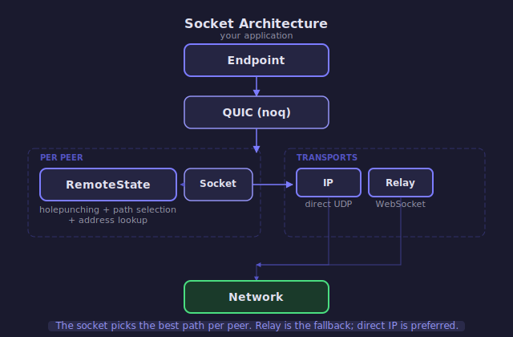

# Socket Architecture

The `Socket` is iroh's connectivity layer between the QUIC endpoint and the network.
It routes packets via the best available path while continuously searching for better ones.

<!-- BEGIN GENERATED SECTION
Source: iroh/src/socket.rs, iroh/src/socket/remote_map.rs, iroh/src/socket/transports.rs
Prompt: Generate a high-level SVG architecture diagram following the style guide in
        _prompts/regenerate.md. Show only the conceptual layers, not individual structs.
-->

<!-- END GENERATED SECTION -->

## How It Works

Your application talks to an `Endpoint`, which uses QUIC (via `noq`) for multiplexed,
encrypted streams. Below QUIC, the `Socket` manages the actual network transport:

- **Per-peer state** (`RemoteStateActor`) handles holepunching and path selection for each
  remote endpoint. It picks the best path and continuously looks for better ones.
  See [remote-state.md](remote-state.md).

- **Transports** move bytes over the wire. Direct UDP (IP transport) is preferred.
  Relay (WebSocket through a relay server) is the fallback that always works.
  See [relay-actor.md](relay-actor.md).

The socket's job is to make the transport layer invisible: your application opens a
connection to a remote `EndpointId`, and the socket figures out how to reach it — relay
first for reliability, then upgrading to direct when possible.

## Key Timeouts

| Constant | Value | Why |
|----------|-------|-----|
| `HEARTBEAT_INTERVAL` | 5s | Keep-alive pings on each path |
| `PATH_MAX_IDLE_TIMEOUT` | 15s | 3x heartbeat — direct paths die after this |
| `RELAY_PATH_MAX_IDLE_TIMEOUT` | 30s | Relay paths get more time (reconnection is slower) |
