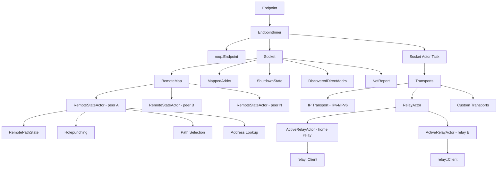

# Socket Architecture Overview

The `Socket` is iroh's connectivity layer. It sits between the QUIC endpoint (`noq::Endpoint`)
and the network, routing packets via the best available path while continuously searching
for better ones.

## Component Hierarchy

<!-- BEGIN GENERATED SECTION
Source: iroh/src/socket.rs, iroh/src/socket/remote_map.rs, iroh/src/socket/transports.rs
Prompt: Read the Socket struct, EndpointInner struct, and the module structure under socket/.
        Generate a flowchart showing the component hierarchy and their relationships.
-->



### Component Responsibilities

| Component | Purpose |
|-----------|---------|
| `Endpoint` | Public API. Owns `EndpointInner`, provides `connect()`, `accept()`, `close()`. |
| `EndpointInner` | Holds `Socket` + `noq::Endpoint` + actor task. Dereferences to `Socket`. |
| `Socket` | Shared state: remote actors map, mapped addresses, discovery, shutdown coordination. |
| `Socket Actor` | Long-running task that drives transports, handles network changes, updates discovery. |
| `RemoteMap` | Maps `EndpointId` to `RemoteStateActor` channels. Creates actors on demand. |
| `RemoteStateActor` | Per-peer actor: manages connections, paths, holepunching, path selection. See [remote-state.md](remote-state.md). |
| `Transports` | Manages IP, relay, and custom transport layers. |
| `RelayActor` | Manages all relay connections. See [relay-actor.md](relay-actor.md). |
| `MappedAddrs` | Bidirectional maps between transport addresses and noq's internal mapped addresses. |
| `DiscoveredDirectAddrs` | Our own discovered direct addresses (local + reflexive). |
| `NetReport` | Network capability reporting (NAT type, relay latency, IPv6 support). |

<!-- END GENERATED SECTION -->

## Key Timeouts

<!-- BEGIN GENERATED SECTION
Source: iroh/src/socket.rs
Prompt: Read all the constant definitions in socket.rs. List them with their values and purposes.
-->

| Constant | Value | Purpose |
|----------|-------|---------|
| `HEARTBEAT_INTERVAL` | 5s | Keep-alive ping interval for paths |
| `PATH_MAX_IDLE_TIMEOUT` | 15s | Max idle time for direct paths (3x heartbeat) |
| `RELAY_PATH_MAX_IDLE_TIMEOUT` | 30s | Max idle time for relay paths (matches QUIC connection timeout) |
| `MAX_MULTIPATH_PATHS` | 12 | Max concurrent QUIC multipath paths per connection |

<!-- END GENERATED SECTION -->

## Datagram Flow (high level)

```
Outgoing:
  Application -> noq::Endpoint -> Socket::poll_send()
    -> RemoteStateActor (select path) -> Transport (IP / Relay / Custom) -> Network

Incoming:
  Network -> Transport -> noq::Endpoint -> Application
  (Relay datagrams bypass RelayActor on receive, going straight to noq)
```
